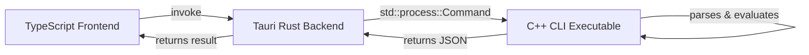

# C++ Powered Tauri Calculator

A beautiful, high-performance desktop calculator built with **TypeScript**, **Tauri v2**, and a custom **C++17** mathematical parser backend.

This project is structured to demonstrate how to integrate native C++ command-line utilities into a modern cross-platform desktop application using Tauri.

---

## 🏗️ Architecture

The application is split into a frontend UI shell and a compiled C++ binary backend:



1. **Frontend (TypeScript + Vite)**: A premium glassmorphic user interface supporting click-to-input, direct keyboard entry, debounced live-preview evaluation, and persistent history tracking.
2. **Bridge (Tauri/Rust)**: Exposes a secure command `evaluate_expression` that calls the C++ binary via standard subprocess execution. During development, it points directly to the C++ build folder; in production, it resolves to the bundled resources.
3. **Backend (C++17)**: A standalone CLI that implements:
   * A **Lexer** that tokenizes formulas into numbers, operators, and brackets.
   * A **Recursive Descent Parser** that handles operator precedence, parenthesized expressions, unary signs, and division-by-zero checks.
   * Prints evaluations as a single-line structured JSON on `stdout`.

---

## 📂 Project Structure

```text
cpp-calculator/
├── calculator-cli/            # C++ Backend CLI
│   ├── src/
│   │   ├── main.cpp           # CLI Entrypoint & JSON output logic
│   │   ├── lexer.h / .cpp     # Formula tokenizer
│   │   └── parser.h / .cpp    # Recursive descent math parser
│   ├── CMakeLists.txt         # CMake build configuration (configured with -static)
│   └── compile_commands.json  # Clangd language server index
├── calculator-ui/             # Tauri & TypeScript Frontend
│   ├── src/
│   │   ├── main.ts            # UI handlers & Tauri IPC bridge
│   │   └── styles.css         # Glassmorphism dark-theme styling
│   ├── src-tauri/             # Rust desktop shell config
│   │   ├── Cargo.toml         # Configured for MinGW linking (staticlib/rlib)
│   │   └── src/lib.rs         # Subprocess invocation code
│   ├── index.html             # UI Shell layout
│   └── package.json           # Node.js dependencies
└── README.md                  # This file
```

---

## 🛠️ Prerequisites

To build and run this project, make sure you have the following installed:

* **Node.js** (v18+) & **npm**
* **Rust** (with the GNU toolchain `stable-x86_64-pc-windows-gnu` enabled)
* **C++ Compiler** (GCC/MinGW-w64 with POSIX threads & UCRT runtime)
* **CMake** (v3.15+) & **Ninja**

---

## 🚀 How to Run

### 1. Build the C++ Backend
Navigate to the `calculator-cli` directory and build the static executable:
```bash
cd calculator-cli
# Configure the build using CMake and Ninja
cmake -S . -B build -G Ninja -DCMAKE_EXPORT_COMPILE_COMMANDS=ON
# Compile the binary
cmake --build build
```
This produces `calculator-cli/build/calculator-cli.exe`.

### 2. Launch the Tauri Application
Navigate to the `calculator-ui` directory, install packages, and start the development server:
```bash
cd ../calculator-ui
# Install UI packages
npm install
# Run Tauri dev server
npm run tauri dev
```
Tauri will automatically check the C++ build folder, compile the Rust bridge, and launch the desktop calculator window.

---

## 🧪 Testing the C++ Backend CLI
You can test the compiler CLI directly from your terminal:

```bash
# Evaluate a valid expression
./calculator-cli/build/calculator-cli.exe "1 + 2 * (3 - 4)"
# Output: {"status":"success","result":-1}

# Test syntax error handling
./calculator-cli/build/calculator-cli.exe "2 * (3 +"
# Output: {"status":"error","message":"Expected a number or '(' at position 7"}
```
